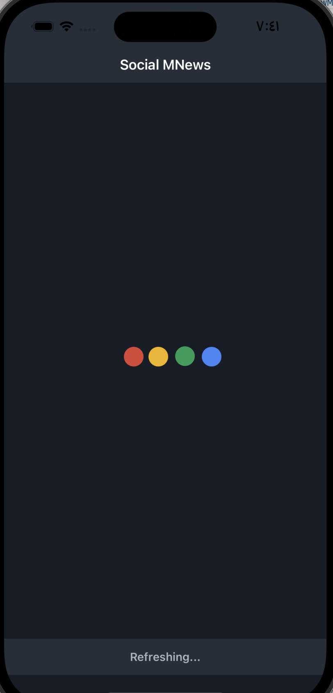
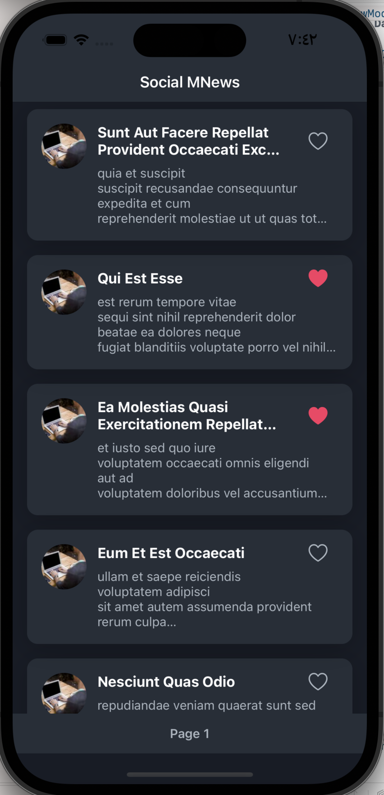
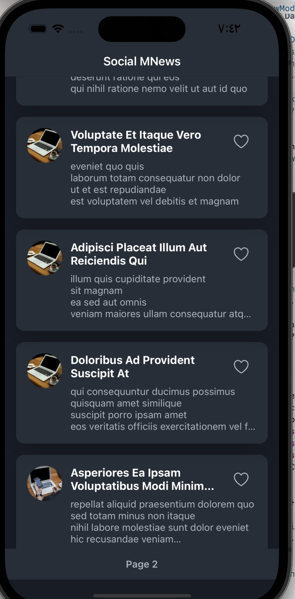
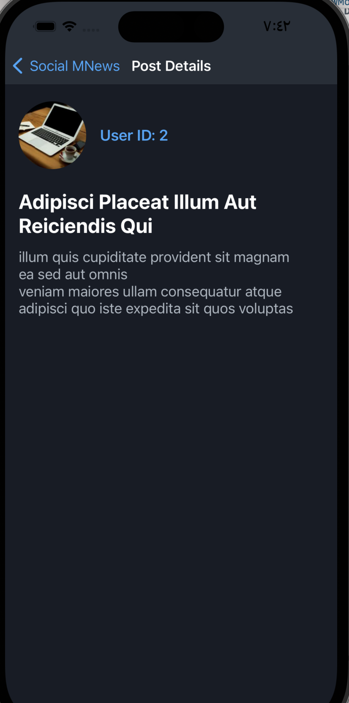

# MNews

**MNews** — это упрощённое приложение для ленты новостей социальной сети, созданное в рамках тестового задания. Оно демонстрирует современные практики разработки для iOS, включая архитектуру MVVM, полностью программный пользовательский интерфейс, сетевые технологии и локальное сохранение данных с использованием Core Data.

---

## 📸 Скриншоты 
<div>
  Загрузка данных  <br>
   
   Главный экран (страница 1, Добавление лайков </img><br>
  Главный экран (страница 2) </img>
  Подробности новости</img>
  Показ изображения новости</img>
</div>

---

## 🧠 Архитектура проекта

Приложение построено с использованием архитектуры **MVVM (Model-View-ViewModel)**:

- **Model**: Представлена объектом `Post` (Core Data `NSManagedObject`) и структурой `PostAPIModel` (`Codable`) для получения данных из API.
- **View**: Включает `FeedViewController` и `PostTableViewCell`. Отвечает за отображение данных и сбор пользовательского ввода. Интерфейс построен программно с использованием AutoLayout. View остаётся «немой» и делегирует все действия во ViewModel.
- **ViewModel**: `FeedViewModel` служит мостом между моделью и представлением. Он получает данные через `NetworkManager`, обрабатывает их, сохраняет в Core Data через `CoreDataManager` и предоставляет подготовленные данные и состояния интерфейса для View. Это разделение улучшает читаемость и тестируемость кода.

Такой подход избавляет от проблемы "раздутого ViewController", перенося бизнес-логику во ViewModel и обеспечивая чистую, поддерживаемую архитектуру.

---

## 🛠 Используемые технологии

- **Язык**: Swift  
- **UI**: UIKit (программная реализация интерфейса с AutoLayout)  
- **Сеть**: `URLSession`, обёрнутый в сервис `NetworkManager`  
- **Хранение данных**: Core Data для офлайн-кэширования и сохранения лайков  
- **Параллелизм**: обработчики `URLSession`, обновления интерфейса через `DispatchQueue`  
- **Архитектура**: MVVM  

---

## ✅ Возможности

- [x] Загрузка публикаций из API JSONPlaceholder  
- [x] Отображение публикаций в `UITableView`  
- [x] Случайный, но постоянный аватар пользователя через Lorem Picsum  
- [x] Сохранение публикаций в Core Data для офлайн-доступа  
- [x] Обновление ленты с помощью жеста «потяни, чтобы обновить»  
- [x] **Бонус:** Отметка «Нравится» с сохранением состояния в Core Data  
- [x] **Бонус:** Бесконечная прокрутка (пагинация) при прокрутке ленты  
- [x] **Бонус:** Индикаторы загрузки и ошибок для лучшего UX  

---

## 🚀 Запуск проекта

1. Клонируйте репозиторий:
```bash
git clone https://github.com/muhammadmajd/MNews.git
2. Откройте `MNews.xcodeproj` в Xcode.

3. Соберите и запустите проект на симуляторе или физическом устройстве.

Проект не имеет внешних зависимостей и должен запускаться «из коробки».
